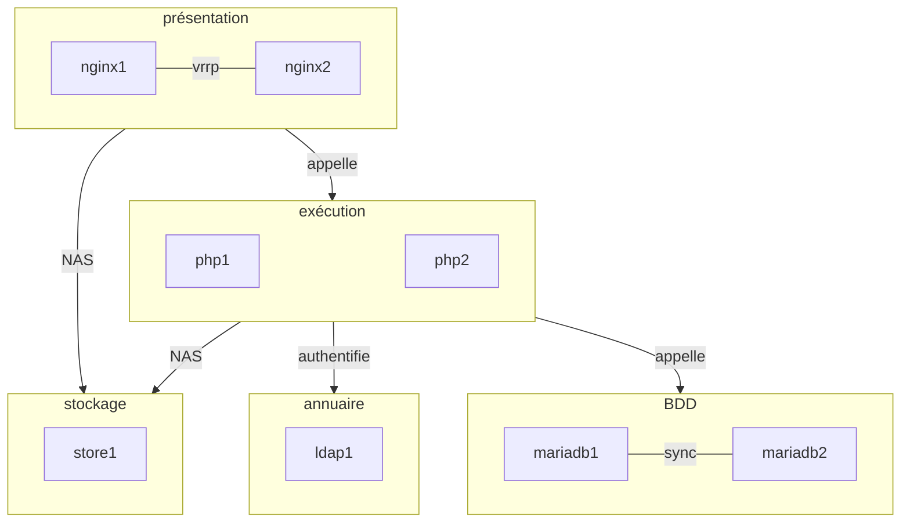
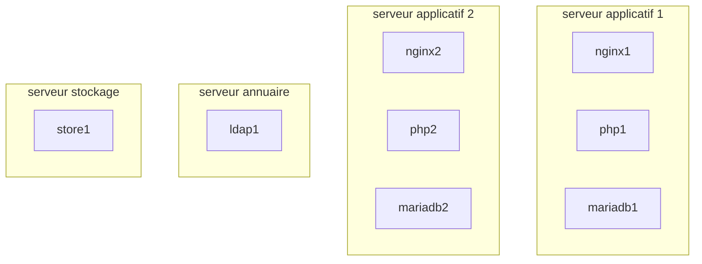
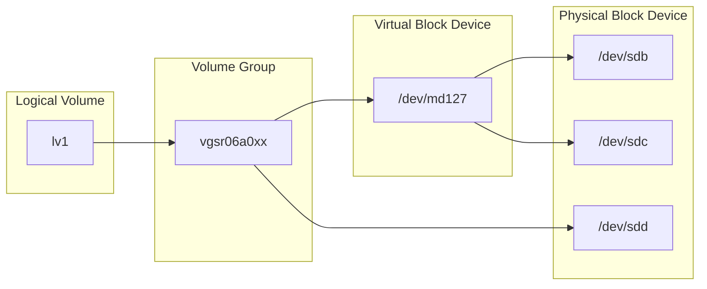

Fichier distribué sous licence Creative Commons [CC-BY-SA](http://creativecommons.org/licenses/by-sa/2.0/)

# Objectif général du projet

L’objectif général du projet est de mettre en place NextCloud, une application Web de stockage et de partage de données, dans un mode le plus redondant possible. Pour cela, nous allons construire :

* un stockage redondant qui assurera la fonction de NAS (via le protocole NFS)
* deux serveurs MariaDB en cluster, assurant redondance des données et de leur accès
* deux serveurs d’exécution PHP-FPM, pour la partie applicative
* deux serveurs de présentation NginX, pour la partie présentation, avec une adresse virtuelle VRRP pour la redondance frontale

Pour des questions d’économie de ressources et de portabilité de cette plateforme vers le TD suivant, les services NginX et PHP-FPM seront déployés sous forme de conteneur Docker sur la même machine virtuelle. Ainsi, ils pourront être transportés et redéployés (aux données près) lors du TD suivant.

Voici la vue sous forme de service de l’ensemble de cette architecture :



Et la vue sous forme de machines :



> On ne s’inquiète pas, ça va bien se passer :)

# Construction d’un serveur NAS avec stockage redondant

## Installation d’une VM Ubuntu Linux Server 20.04

Nous allons commenmcer par créer une *Golden Image* (une image de machine virtuelle qui nous servira de base pour l’ensemble des VMs créées au cours de ce TD). Pour cela effectuer une installation standard d’Ubuntu Linux Server 20.04 (sans paramètre particulier, pensez simplement à installer le serveur SSH). Vous devriez avoir deux interfaces réseaux, toutes deux en DHCP, vous permettant d’accéder au monde extérieur et votre propre petit réseau privé.

Quelques paramètres que vous pouvez optimiser sur Proxmox :

* Dans `System`, cochez `Qemu Agent` (cela servira pour avoir l’adresse IP et d’autres paramètres directement depuis l’interface de Proxmox)
* Dans `Hard Disk`, sélectionnez `VirtIO Block` (cela permet d’optimiser considérablement les performances disque)

Une fois l’installation terminée, supprimez le fichier `/etc/machine-id` et recréez-le (via `systemd-machine-id-setup`). Éteignez la machine.

Dans l’interface de Proxmox, vous pouvez maintenant la transformer en *template*.

Chaque fois que vous ferez un clone de cette machine, il vous faudra :

* supprimer le fichier `/etc/machine-id` et le recréer (via `systemd-machine-id-setup`)
* supprimer les clés SSH dans `/etc/ssh/ssh_host_*`
* modifier le fichier `/etc/hostname`

> À partir de ce moment, vous pourrez prendre la main en SSH sur la machine virtuelle avec l’utilisateur par défaut.

## Premier clone

Effectuez votre premier clone. Cette machine servira de stockage partagé pour l’ensemble des autres machines. Associez 3 disques de taille égale (environ 10 Gio).

> Pour cette première machine, je vous conseille de faire un clone complet. Les suivantes pourront utiliser des clones liés si nécessaires.
> Je vous conseille également de vérifier que votre `machine-id` et les autres options semblent correctes. Cette machine est vouée à rester en marche pendant toute la durée du TD, autant la soigner au maximum.

## Systèmes redondants de données: RAID

Objectif de cette partie :



- 将sdb和sdc两个块设备，合并成一个虚拟块设备 /dev/md127，再将其变为物理卷

- sdd则是单独的块设备，直接将其变为物理卷

将两者合并为一个卷组， 然后称为一个虚拟卷

### Création d’un RAID1 logiciel

> Vous pouvez vérifier les partitions/disques à votre disposition avec la commande `lsblk`

Vous allez créer un array en RAID1 à partir de deux disques virtuelles. À partir des deux block devices physiques disponibles (`/dev/sdb` et `/dev/sdc`), vous allez pouvoir construire un block device virtuel grâce à la commande `mdadm` (`/dev/md127` dans notre cas) :

```bash
# 将两个物理块设备/dev/sdb /dev/sdc合并成一个虚拟块设备 并采用raid1模式 虚拟块设备名为/dev/md127
mdadm --create /dev/md127 --level=1 --raid-devices=2 /dev/sdb /dev/sdc
```

`--level` permet de spécifier le type de RAID que vous souhaitez (0, 1, 5, 10, etc…). `--raid-devices` précise le nombre de partitions ou block devices physiques concernés par ce RAID. L’ordre dans lequel vous listez les partitions va déterminer quelle partition sera considérée comme maître.

Vous pouvez constater la progression de la construction (ou de la reconstruction) du RAID via le fichier `/proc/mdstat`.

```bash
# 查看目前的虚拟块设备信息
cat /proc/mdstat

Personalities : [raid1]
md127 : active raid1 sdc[1] sdb[0]
      38981632 blocks [2/2] [UU]
unused devices: <none>
```

`[0]` indique le volume maître. `[2/2]` indique le nombre de disques online pour cet array et `[UU]` les disques online.

> Que se passe-t-il maintenant quand le système veut écrire sur le block device virtuel `/dev/md127` ?

### Mise en défaut du RAID

Pour l’instant, votre RAID1 se porte bien. Voyons ce qui se produit si nous le titillons un peu…

Commencez par formater le block device `/dev/md127` que vous avez créé en `ext4` :

```bash
mkfs.ext4 /dev/md127
### 格式化
```

Remarquez au passage qu’il est vu comme une simple block device. Montez la partition dans `/mnt` et placez quelques fichiers dedans.

Vérifiez l’état de votre RAID :

```
# mdadm --detail /dev/md127
```

Maintenant, nous allons artificiellement déclarer un des block devices composant le RAID comme défectueux :

```bash
# 声明sdc为故障
# mdadm --manage /dev/md127 --fail /dev/sdc
mdadm: set /dev/sdc faulty in /dev/md127
```

Vous pouvez maintenant constater, dans le fichier `/proc/mdstat` que votre RAID fonctionne en mode dégradé.

> Pouvez-vous toujours accéder à vos données ? Vos fichiers ont-ils été endommagés ?

Enlevez le volume défaillant du groupe RAID :

```bash
# 从虚拟块中删除物理块设备
# mdadm --manage /dev/md127 --remove /dev/sdc
mdadm: hot removed /dev/sdc
```

Jetez un œil dans /proc/mdstat pour constater que le volume est à présent marqué comme manquant. Vous pouvez de nouveau l’ajouter au groupe RAID et constater que ce dernier va se reconstruire tout seul :

```bash
# 向虚拟块中添加物理块设备
# mdadm --manage /dev/md127 --add /dev/sdc
mdadm: re-added /dev/sdc
```

Évidemment, pour l’utilisateur, la défaillance du disque, sa suppression du groupe RAID et l’ajout d’un « nouveau » disque ont été complètement transparents.

> Que se passe-t-il si le maître est marqué comme défaillant au moment de la reconstruction du RAID ?

## Gestionnaire de volumes logiques : LVM


> Note : `lv1` va du coup être aussi un block device virtuel

### Création d’un Volume Group

Démontez `/dev/md127` de votre arborescence.

Créez un Physical Volume sur ce le dernier disque de la machine :

```bash
# 将sdd变为一个物理卷
# pvcreate /dev/sdd
```

Le volume physique est à présent initialisé correctement. Créez un groupe de volumes :

```bash
# 创建一个物理卷组
# vgcreate vgsr06a0xx /dev/sdd
```

Le VG est à présent prêt pour recevoir des volumes logiques. Contrôlez le nombre de physical extents disponibles dans votre VG :

```
# vgdisplay
  --- Volume group ---
  VG Name               vgsr06a0xx
  System ID
  Format                lvm2
  [...]
  VG Size               672,00MB
  PE Size               32,00 MB
  Total PE              21
  Alloc PE / Size       0 / 0,00 MB
  Free  PE / Size       21 / 672,00 MB
  VG UUID               Dngwte-RuVl-CdqX-fEAG-2YE9-BdiS-EE12x6
```

Créez en conséquence un LV :

```bash
# 通过卷组创建一个虚拟卷
# lvcreate --size 200M --name lvtest vgsr06a0xx
```

Créez un système de fichiers dans ce LV et montez-le dans votre arborescence (dans `/mnt` par exemple).

> Quel est le type du fichier /dev/<volume_group>/<logical_volume> ?
>
> ```bash
> # 软链接
> mkfs -t ext4 /dev/group/lv_name # 格式化
> mount  /dev/group/lv_name /mnt # 挂载
> 
> umount /mnt # 取消挂载
> ```

### Agrandissement du Volume Group

Comme illustration de la grande force de LVM, nous allons agrandir la taille du groupe de volumes, du volume logique puis du système de fichiers que nous venons de créer.

On commence par créer un nouveau PV à partir de la partition RAID de la partie I. :

```bash
# 将md127虚拟块设备变成物理卷
# pvcreate /dev/md127
```

On étend le groupe de volumes avec ce nouveau PV :

```bash
# 将md127物理卷加入卷组中
# vgextend vgsr06a0xx /dev/md127
```

Vous pouvez constater à l’aide de `pvs`, `vgs`, `pvdisplay` et `vgdisplay` que votre groupe de volumes dispose maintenant de plus d’extents… dont nous allons faire profiter le seul LV qui l’occupe.

Étendez le LV (ne prenez que quelques extents, juste de quoi dépasser la taille du RAID d’origine) :

```bash
# 将虚拟卷的大小扩大 因为之前对应的卷组中加入了新的物理卷
# lvextend --size +15G /dev/vgsr06a0xx/lvtest
```

À présent, redimensionnez votre système de fichiers pour le faire correspondre à la taille du LV :

```bash
# 重置虚拟卷大小
# resize2fs /dev/vgsr06a0xx/lvtest
```

> Que constatez-vous au niveau du volume logique monté ? Y a-t-il eu interruption de service ? Est-ce qu’une opération de ce type est possible avec des partitions standards ?
>
> 不存在服务下线和中断 快照是实时的 不实用快照 单纯用分区备份 无法实现
>
> Est-ce que la même opération est possible pour réduire un volume logique ? Quelles précautions faut-il prendre ?
>
> 可以 要先把移除空间中的内容迁移

### Manipulation de snapshots

Placez quelques fichiers sur le volume logique monté que vous venez d’agrandir. Vérifiez qu’il vous reste de la place dans le groupe de volume correspondant. Créez un volume de snapshot à partir du volume montée :

```bash
# 通过lvtest虚拟卷 创建一个快照lvtest_snap 快照也是一个虚拟卷 可以将快照挂载到目录下 就可以看到快照的内容
# lvcreate --snapshot --extents 200 --name lvtest_snap /dev/vgsr06a0xx/lvtest
```

Regardez le statut des volumes logiques :

```
# lvs
  LV        VG   Attr   LSize  Origin Snap%  Move Log Copy%  Convert
  lvtest    test owi-ao  1,83G
  test_snap test swi-a- 40,00M lvtest   0,00
```

Supprimez des fichiers du volume logique monté. Vérifiez de nouveau le statut des volumes logiques. Essayez de monter en lecture seule le volume de snapshot.

> Que constatez-vous quant à la taille du snapshot une fois les fichiers supprimés ? Quel est le contenu du snapshot que vous avez monté ? 快照变大 快照记录的是所有的改变

Essayez de faire un autre snapshot et faites quelques manipulations de fichiers supplémentaires.

> Que pensez-vous des performances disque d’un tel système ? Est-il possible de l’utiliser dans des conditions de production ? Sous quelles réserves ?

Montez une des partitions de snapshot en écriture (option rw sur mount). Modifiez un fichier.

> mount -rw /dev/group_name/lvsnap_name /mnt
>
> Est-ce que le fichier d’origine a été modifié ? Que pouvez-vous envisager de faire grâce à ce genre de manipulation ?
>
> 没改

## Partage NAS avec NFS

Avant de procéder, nous allons supprimer le disque `/dev/sdd` du volume group que vous avez créé et détruire le logical volume lvtest :

```bash
删除快照 删除虚拟卷 将块设备从物理卷中删除
# lvremove /dev/vgsr06a0xx/lvtest_snap
# lvremove /dev/vgsr06a0xx/lvtest
# vgreduce vgsr06a0xx /dev/sdd
```

Éteignez votre machine, sortez le disque de la configuration et redémarrez.

### Configuration du serveur NFS

Ensuite, installez les paquets nécessaires pour transformer votre machine en serveur NFS :

```
# apt install nfs-kernel-server
```

Créez un logical volume (4GB devrait suffire), formatez-le, montez-le dans `/srv` et ajoutez-le dans `/etc/fstab`.

Éditez le fichier `/etc/exports` avec une ligne de ce style :

```
/srv	10.0.2.0/24(rw,sync,no_subtree_check)
```

> La ligne de configuration se lit comme suit : système de fichier local, adresses vers lesquelles il est exporté puis droit. Vous devez bien évidemment adapter cette configuration.

Redémarrez le service `nfs-server` pour rendre la configuration effective.

```bash
systemctl restart nfs-server
```


### Configuration d’un client NFS

Clonez de nouveau votre machine de base et démarrez-la. Nous allons nous en servir comme client NFS et vérifier que tout fonctionne correctement. Installez les paquets NFS client :

```
# apt install nfs-common
```

Vous pouvez ensuite constater que le partage est effectif :

```
# showmount -e <ip du serveur>
```

Montez-le dans le répertoire `/mnt` :

```
mount -t nfs <ip du serveur>:/srv /mnt
```

> Pouvez-vous écrire des fichiers sur ce montage ? Pourquoi ?

### Configuration avancée

Nous allons créer un dossier `test` du côté du serveur NFS qui sera accessible à l’utilisateur ayant l’UID 1000 (le premier utilisateur du système dans la configuration actuelle).

几号用户在服务器创建的目录 就只能由对应的几号用户使用

Sur le serveur, créez un répertoire dans `/srv` (le point de montage du serveur NFS) et donnez-lui les bonnes autorisations.

> Peut-on alors écrire des données dans l’utilisateur 1000 depuis le client ? Que constatez-vous côté serveur NFS ?

Nous allons tester la persistence du montage. Éditez le fichier `/etc/fstab` sur le client et ajoutez la ligne suivante :

```
持久化
<ip du serveur>:/srv	/srv	nfs	users,noauto,x-systemd.automount,x-systemd.device-timeout=10	0	0
```

Redémarrez et vérifiez que le client NFS se déclenche lorsque vous essayez d’accéder au dossier `/srv`.

> Vous pouvez créer un dossier `/srv/http` et lui attribuer les droits de l’UID 33 (utilisateur `www-data` sur tous les systèmes que nous allons installer).

Si tout fonctionne correctement, vous pouvez supprimer complètement cette machine de test. Lors de l’installation de NextCloud, les machines frontales (présentation avec NginX et exécution avec PHP-FPM) auront besoin d’accéder au NAS hébergé sur la machine de stockage.

# Serveur LDAP

## LDAP

Clonez votre machine de base et faites les réglages nécessaires dessus (`/etc/hostname`, configuration SSH, etc…).

Installez OpenLDAP :

```bash
# 安装ldap
apt install slapd ldap-utils
```

Après l’installation, utilisez l’utilitaire de configuration de paquet pour créer la racine de votre annuaire LDAP ainsi que le compte administrateur de l’annuaire :

```bash
# 初始化配置
dpkg-reconfigure slapd
```

L’utilitaire vous guidera dans la création de votre annuaire. Donnez comme nom DNS :

```
<nom-du-groupe>.utc
```

Donnez à votre racine un nom de type :

```
dc=<nom-du-groupe>,dc=utc
```

> Attention ! Les deux doivent avoir des noms similaires…

### Création des Organizational Units

Notre arbre va avoir la représentation suivante :

```mermaid
graph TD
dc=utc --> dc=sr07a0xx
dc=sr07a0xx --> ou=Users
dc=sr07a0xx --> ou=Groups
```

Commencez par créer un fichier LDIF et ajoutez-y les informations suivantes :

```
dn: ou=Users,dc=<nom-du-groupe>,dc=utc
objectclass: organizationalUnit
ou: Users
```

Vous venez de définir une Organizational Unit ou OU. Ajoutez ces informations au LDAP avec la commande `ldapadd` :

```
$ ldapadd -x -D 'cn=admin,dc=<nom-du-groupe>,dc=utc' -W -f init.ldif
```

> -x précise que l’on utilise pas de connexion sécurisée (en temps normal, il faudrait utiliser une connexion chiffrée mais ce n’est pas le but de l’exercice) et il faudra donc le mettre systématiquement. -D permet de se *binder* au LDAP en tant qu’utilisateur `admin`.

Vous devriez normalement pouvoir voir le contenu du LDAP :

```
$ ldapsearch -x -b 'dc=<nom-du-groupe>,dc=utc' '(objectclass=*)'
```

Sur le même principe, vous allez créer l’OU Groups qui contiendra les groupes d’utilisateurs, sur le même modèle que précédemment.

### Création d’un carnet minimal d’utilisateurs

Vous pouvez créer des utilisateurs dans le LDAP avec la commande ldapadd(1) et quelques fichiers LDIF. Voici un exemple d’utilisateur et de groupe :

```
dn: uid=cveret,ou=Users,dc=<nom-du-groupe>,dc=utc
uid: cveret
cn: Clément VÉRET
objectClass: account
objectClass: posixAccount
objectClass: top
objectClass: shadowAccount
userPassword: {SSHA}<hash de mot de passe>
loginShell: /bin/bash
uidNumber: 600
gidNumber: 10000
homeDirectory: /home/cveret
```

> Vous pouvez facilement obtenir un hash de mot de passe à l’aide de la commande `slappasswd`.

Créez le groupe primaire de cet utilisateur, ainsi qu’un groupe secondaire :

```
dn: cn=groupe_td,ou=Groups,dc=<nom-du-groupe>,dc=utc
objectClass: posixGroup
objectClass: top
cn: groupe_td
gidNumber: 10000

dn: cn=groupe_secondaire,ou=Groups,dc=<nom-du-groupe>,dc=utc
objectClass: posixGroup
objectClass: top
cn: groupe_secondaire
gidNumber: 10001
memberUid: cveret
```

Après les avoir ajoutés, vérifiez à l’aide de `ldapsearch` que les utilisateurs et groupes sont correctement définis. Créez quelques utilisateurs supplémentaires sur le même modèle.

Vérifiez également que les mots de passe sont correctement définis : utilisez l’un des utilisateurs créés au lieu de l’utilisateur admin pour vous binder au LDAP lors de vos recherches.

# Machines applicatives

Clonez deux machines supplémentaires. Modifiez leur paramétrage correctement. Formatez et montez un volume iSCSI distant sur chaque machine dans `/var/lib/mysql`.

Montez sur les deux machines le même partage NFS dans `/srv`.

Pour finir, installez Docker sur les deux machines avec la méthode de votre choix.

> Il est rappelé que chaque composant du TD pourrait être mis sur une machine physique, une machine virtuelle, un conteneur léger type LXC ou un conteur Docker. Tout dépend de l’usage et du contexte dans lequel vous avez à faire tourner ce type d’infrastructure.

**À partir de ce moment, toutes les manipulations seront à faire sur les deux serveurs applicatifs que vous venez de cloner.**

# Cluster MariaDB

## Installation de MariaDB et paramétrage de Galera Cluster

Activez les dépôts `universe` sur la machine en ajoutant le mot clé correspondant dans `/etc/apt/sources.list` (juste après le mot-clé `main`). Installez MariaDB sur chacune des machines :

```
# apt update && apt install mariadb-server
```

Créez un fichier `/etc/mysql/mariadb.conf.d/galera.cnf` avec le contenu suivant sur le nœud 1 du cluster :

```
/// 配置集群
[mysqld]
binlog_format=ROW
wsrep_provider=/usr/lib/libgalera_smm.so
wsrep_cluster_name="cluster_sr06"
wsrep_cluster_address="gcomm://"
wsrep_sst_method=rsync
wsrep_on=ON
wsrep_node_address="<adresse IP nœud 1>"
wsrep_node_name="node1"
```

Cette configuration va permettre d’initialiser le nœud MariaDB du cluster Galera. Arrêtez le service `mariadb` et lancez la commande suivante :

```
启动集群
# galera_new_cluster
```

Relancez le service `mariadb`. Le premier nœud est initialisé. Sur le second nœud, créez également un fichier `/etc/mysql/mariadb.conf.d/galera.cnf` similaire au premier. Changez simplement l’adresse du nœud et indiquez cette fois-ci l’adresse du cluster Galera :

```
加入两台机器的地址
wsrep_cluster_address="gcomm://<adresse IP nœud 1>,<adresse IP nœud 2>"
```

Redémarrez le service `mariadb` sur le second nœud. Revenez sur le premier nœud et indiquez de nouveau l’adresse complète du cluster (comme ci-dessus).

À partir de maintenant, **les deux nœuds sont synchrones**. Il faut donc impérativement que l’un soit démarré pour que l’autre puisse démarrer (pour récupérer le log binaire des dernières transactions). Si vous devez redémarrer le cluster au complet, il faut impérativement retoucher la commande `wsrep_cluster_address` sur le premier nœud à démarrer avant de démarrer le second, puis remettre la valeur d’origine.

## Initialisation de la base de données MariaDB

Sur le nœud 1, lancez le script d’initialisation de la base et suivez les instructions :

```
# mysql_secure_installation
```

Connectez-vous au premier nœud du cluster et créez une base `nextcloud` et un utilisateur associé :

```
# mysql -u root
MariaDB [(none)]> CREATE DATABASE nextcloud;
MariaDB [(none)]> GRANT ALL PRIVILEGES ON nextcloud.* TO ncuser IDENTIFIED BY 'super_mot_de_passe';
```

Vérifiez sur le second nœud que vous pouvez bien vous connecter en tant qu’utilisateur `ncuser` et que vous voyez la base de données :

```
# mysql -u ncuser -psuper_mot_de_passe
MariaDB [(none)]> SHOW DATABASES;
```

Si c’est le cas, votre cluster MariaDB est bien synchrone.

> Lors de la configuration de votre instance NextCloud, vous ne pourrez préciser qu’une seule adresse IP pour le cluster MariaDB. Il est possible de prendre en compte les deux, mais cela exige une configuration plus avancée qui sort du cadre de ce TD.

Pour terminer la configuration, assurez-vous que MariaDB écoute bien sur toutes les interfaces réseaux (et toutes les adresses) en commentant la ligne ci-dessous dans le fichier `/etc/mysql/mariadb.conf.d/50-server.cnf` :

```
bind-address = 127.0.0.1
```

# NginX, PHP-FPM et VRRP

## Installation et paramétrage de Keepalived

> N’oubliez pas d’utiliser l’interface ens19 branchée sur votre réseau DHCP/GNS3 pour cette partie ! Choisissez une adresse fixe dans ce réseau pour les deux machines applicatives et une troisième adresse fixe pour l’adresse IP partagée.

Keepalived permet de faire du VRRP (*Virtual Router Redundancy Protocol*) : une adresse IPv4 ou IPv6 virtuelle est présente sur la machine principale. Si cette dernière n’est plus joignable ou défaillante, l’adresse sera reprise automatiquement par une autre machine, garantissant ainsi la continuité de service.

Pour simplifier, nous n’allons faire de redondance que sur une adresse IPv4, mais c’est applicable de la même manière à un groupe d’adresses hétérogènes.

Installez Keepalived :

```
keepalive软件 用于做VRRP (Virtual Router Redundancy Protocol) 两台机器主从备份 主机挂了 备用机回顶替
# apt install keepalived
```

### Paramétrage du maître VRRP

Nous allons maintenant créer une adresse IP virtuelle sur l’un des deux serveurs.

Les adresses IPv4 ou IPv6 virtuelles dans VRRP sont systématiquement associées à une interface réseau et à un numéro (le VRID, Virtual Router ID). Chaque machine faisant du VRRP fait une annonce en broadcast sur son segment réseau à intervalle régulier pour signaler qu’elle est vivante et est capable de prendre en charge un VRID (et donc une ou plusieurs adresses IP associées). Cela permet d’avoir plusieurs communautés VRRP dans le même segment réseau.

Chaque VRID est ensuite regroupé dans un groupe VRRP. En cas de défaillance d’une interface dans le groupe, l’ensemble des adresses IP dans le VRID associé bascule sur une autre machine.

**Comme toutes vos machines virtuelles sont dans le même segment réseau, prenez votre numéro de groupe comme *VRID* et choisissez une adresse reprenant aussi votre numéro de groupe.**

Pour notre cas, nous n’allons avoir qu’un seul groupe avec un seul VRID contenant une seule adresse pour une seule interface. Créez le fichier `/etc/keepalived/keepalived.conf` sur la machine maître avec le contenu suivant :

```
vrrp_sync_group VRRP_GRP1 {
	group {
		VIP_ETH
	}
}

vrrp_instance VIP_ETH {
	# State = Master ou Backup
	state MASTER
	# l’interface qui servira pour les annonces VRRP
	interface ens18
	# VRID
	virtual_router_id 10
	# la priorité de ce nœud VRRP dans le groupement
	priority 100
	version 3
	/// 这个是他们共用的虚拟ip地址
	virtual_ipaddress {
		192.168.56.200
	}
}
```

> Choisissez bien soigneusement l’adresse de redondance de sorte à ce qu’elle ne puisse pas être en conflit avec d’autres adresses (choisissez-la hors de la plage DHCP de préférence)

La configuration du serveur secondaire se fait exactement de la même manière à deux détails près : `state` doit être réglé sur `BACKUP` et `priority` doit être amené à un nombre inférieur.

Une fois cette configuration faite, redémarrez le service `keepalived` vérifiez que vous pouvez joindre cette adresse depuis la machine hôte (avec `ping` par exemple). Vous pouvez également observer l’adresse secondaire sur l’interface configurée :

```
$ ip -4 address show dev ens18
2: ens18: <BROADCAST,MULTICAST,UP,LOWER_UP> mtu 1500 qdisc pfifo_fast state UP group default qlen 1000
	inet 192.168.56.101/24 brd 192.168.56.255 scope global eth0
		valid_lft forever preferred_lft forever
	inet 192.168.56.200/32 scope global secondary eth0
		valid_lft forever preferred_lft forever
```

> Que se passe-t-il si vous éteignez la machine maître ? Combien de temps faut-il pour que la bascule soit effective ?

## Installation et paramétrage de NginX

NextCloud ne peut plus fonctionner sans HTTPS. Nous allons donc créer un certificat auto-signé pour permettre à votre configuration de NginX de fonctionner correctement.

```
$ openssl req -x509 -newkey rsa:4096 -sha256 -nodes -keyout nextcloud.key -out nextcloud.crt -days 365
```

Récupérez un fichier de configuration (à adapter) dans la [documentation officiel de NextCloud](https://docs.nextcloud.com/server/stable/admin_manual/installation/nginx.html).

Il sera nécessaire d’y faire les adaptations suivantes :

* chemin des certificats SSL (mot-clé `ssl_certificate` et `ssl_certificate_key`)
* URI du site (mot-clé `server_name`) que vous pouvez initialiser à une valeur quelconque (`nextcloud.utc` par exemple)
* adresse IP des deux serveurs applicatifs pour la partie PHP (section `upstream`)
* chemin d’accès à NextCloud (dans votre partage NAS en `/srv/http/nextcloud` par exemple, mot-clé `root`)
* concaténer le fichier de configuration par défaut avec celui-ci.

Vous pouvez ensuite regrouper l’ensemble de vos fichiers de configuration dans un dossier et présenter au conteneur le fichier `nginx.conf` ainsi que les , en même temps que le dossier NFS :

```
# docker run -d \
	--name nginx \
	-p 80:80 \
	-p 443:443 \
	-v /chemin/conf/:/etc/nginx/conf.d \
	-v /srv/http:/srv/http \
	nginx
```

Pour pouvoir accéder à votre NextCloud depuis votre machine hôte, vous devrez ajouter l’adresse VRRP et l’URI du site choisi dans le fichier `/etc/hosts` sur l’hôte.

> C’est normalement une **TRÈS TRÈS** mauvaise pratique, mais pour les besoins du TD, nous passerons outre.

À ce stade et même sans avoir installé NextCloud, vous devriez être en capacité d’accéder à votre site Web (qui fera une magnifique erreur 502…). Reproduisez la même configuration sur le second serveur applicatif.

## Installation et paramétrage de PHP-FPM

Nous allons de nouveau utiliser une image Docker pour PHP, mais pas l’image officielle (celle-ci ne contient pas par défaut toutes les extensions dont nous avons besoin).

Lancez le conteneur PHP de la manière suivante :

```
# docker run -d \
	--user 1001:1001 \
	--name php \
	-p 9000:9000 \
	-v /srv/http:/srv/http \
	bitnami/php-fpm
```

[Téléchargez la dernière version de NextCloud Server](https://nextcloud.com/install/#instructions-server), décompressez-la dans le répertoire NAS monté sur l’une des deux machines. Paramétrez correctement les droits du répertoire (accessible en lecture/écriture pour l’utilisateur ayant l’UID/GID `1001`). Assurez-vous qu’il est bien accessible par le même chemin sur les deux machines.

> Étant donné la façon dont fonctionne les droits d’accès, je vous recommande de le faire sur le NAS directement et d’y positionner les droits d’accès. Vous aurez besoin du logiciel `unzip` pour décompresser l’archive.

# Vos objectifs pour le projet

Pour le projet :

* vous devez paramétrer votre instance NextCloud pour que sa base de données soit stockée sur votre instance redondée MariaDB (prenez l’une ou l’autre des IP de votre cluster MariaDB)
* vous devez paramétrer le module LDAP de votre instance NextCloud pour aller chercher vos utilisateurs et vos groupes sur l’annuaire LDAP que vous avez paramétré ([encore une fois, la doc est là pour vous aider](https://docs.nextcloud.com/server/14/admin_manual/configuration_user/user_auth_ldap.html))
* lors du paramétrage LDAP, vous devrez préciser les classes d’objets correspondants à vos utilisateurs et groupes dans votre annuaire. Pour notre cas, la requête LDAP sera la suivante pour les utilisateurs :

```
(|(objetClass=posixAccount))
```

Et la suivante pour les groupes :

```
(|(objectClass=posixGroup))
```

* afin de montrer que tout cela fonctionne, vous devrez créer 3 utilisateurs dans NextCloud (A, B, C), puis créer un partage de l’utilisateur A vers les utilisateurs B et C. Lorsqu’un des utilisateurs se connectent, il doit être en capacité de voir le partage en question.