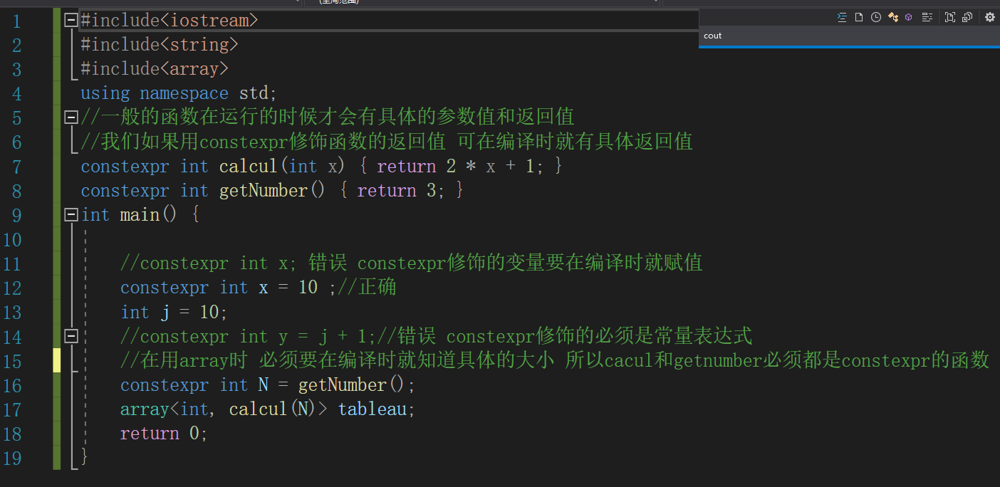

### Some c++ basic(1)

---

1. 常量成员函数可以防止在函数内对类成员变量值的更改

   这里列出了四种组合 其中第二种会报错，这意味着**常量成员函数的返回值也必须用const修饰**


2. 关于friend:

   在一个类中，被friend关键字修饰的类/函数，可以访问该类的私有变量，但是由于friend的的特殊性，两各类都需要在已知另一个类的前提条件下才能生效，这就意味着我们需要先声明其中一个类。


3. 关于const和引用:

   被const修饰的变量，在**获取其引用时也一定要添加上const关键字**，不然则会报错，这是因为如果一旦你通过引用（地址）对其进行了修改，那他就不再是const了

   ```c++
   const int a = 10;
   const int& refa = a; //正确
   int& refa2 = a;//错误
   ```

   

4. 几种构造函数：


5. 函数返回引用/函数返回引用作为左值/常量成员函数和非常量优先级

   ```c++
   class person{
    public:
       int x;
       int y;
       int& f1(){
           cout<<"not const"<<endl;
           //为了返回局部变量，手动开辟内存并且返回引用
           int* temp = (int*)malloc(sizeof(int))
           *temp = 1;
           return *temp;
       }
       const int& f1() const {
           int* temp = (int*)malloc(sizeof(int))
           *temp = 1;
           return *temp;
           cout<<"const"<<endl;
       }
   }//我们设置两个成员函数，一个为常量成员函数，一个为非常量成员函数
   
   int main(){
       person p1;
       const person& p2 = p1;
       p1.f1(); //输出not const
       p2.f2(); //输出const
       
       p1.f1() = 10;//ok
       p2.f1() = 10;//错误 因为返回引用为const
   }
   ```

6. assert函数

   Assert()当其中为真时 无事发生，当其中为假时 报错

   当在头文件中define NEGBUG时，assert不会起作用


7. 关键字auto和decltype


8. 关键字extern


9.枚举类型enum


10. typedef 和 using


11. 关键字constexpr



12. malloc和namespace


13. 一些指针使用上的细节


14. 关于static

静态成员函数只能访问静态成员变量，并且没有this指针


