### Some c++ basic(2)

---

1. 运算符重载

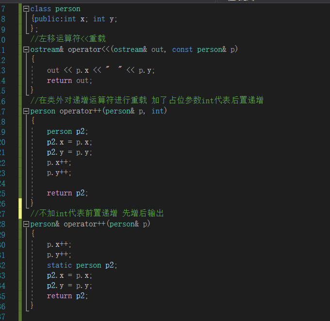

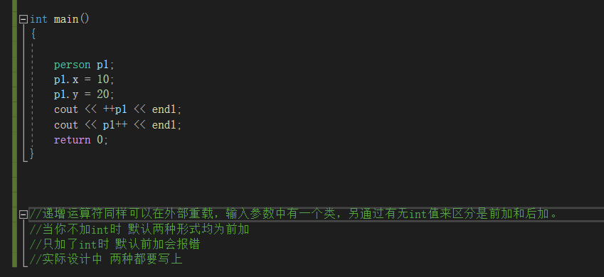

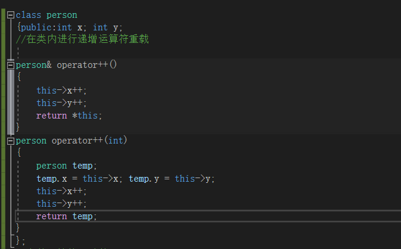

2. 继承相关

   **1) public继承方式**

   - 基类中所有 public 成员在派生类中为 public 属性；
   - 基类中所有 protected 成员在派生类中为 protected 属性；
   - 基类中所有 private 成员在派生类中不能使用。

   **2) protected继承方式**

   - 基类中的所有 public 成员在派生类中为 protected 属性；
   - 基类中的所有 protected 成员在派生类中为 protected 属性；
   - 基类中的所有 private 成员在派生类中不能使用。

   **3) private继承方式**

   - 基类中的所有 public 成员在派生类中均为 private 属性；
   - 基类中的所有 protected 成员在派生类中均为 private 属性；
   - 基类中的所有 private 成员在派生类中不能使用。

3. 继承中的**构造函数**

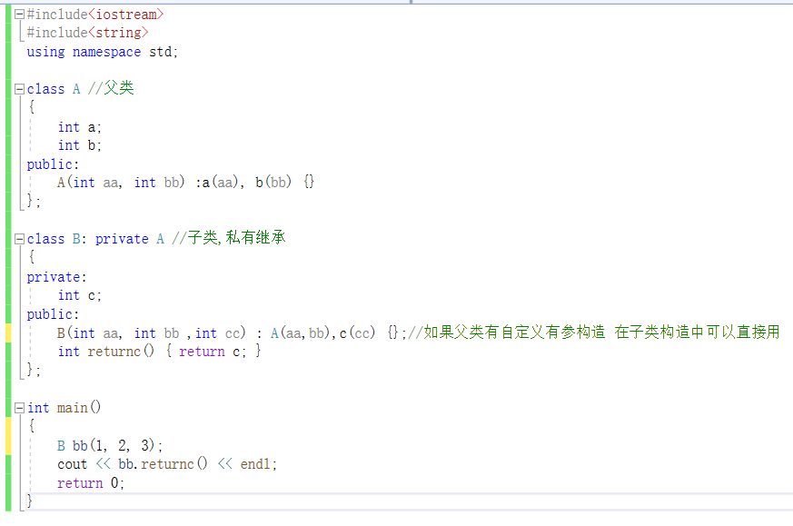

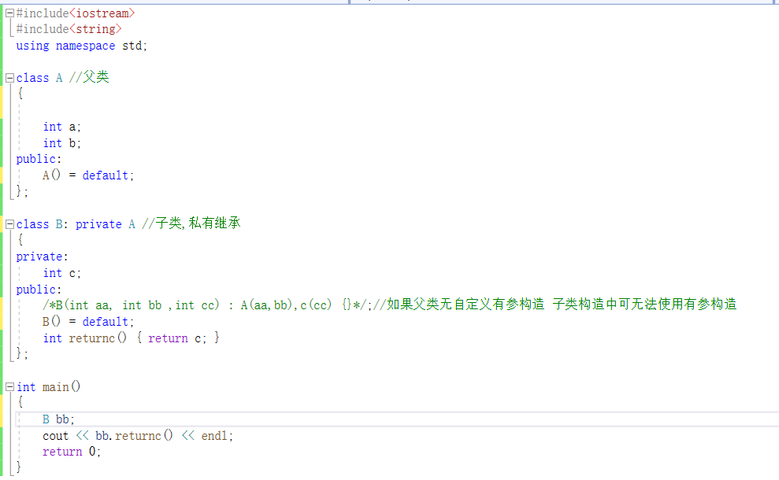

4. 继承中函数重写的**优先级**

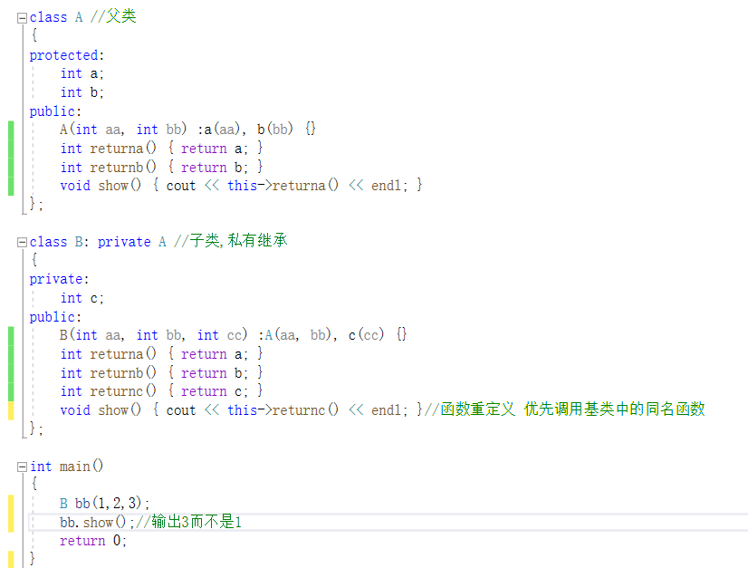

​     当然，我们也可以强制改变函数重载的优先级 使用using

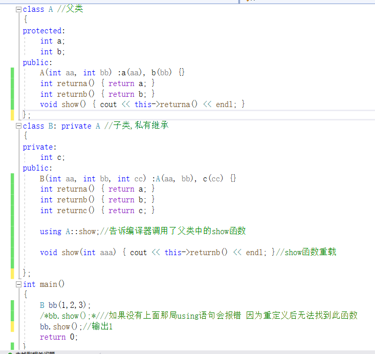

5. 多重继承

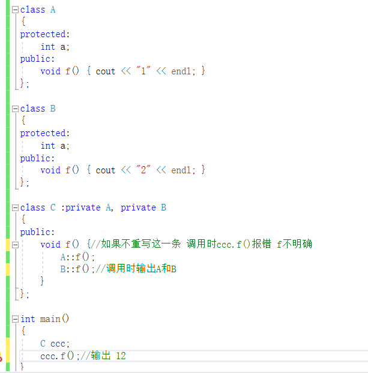

6. 父子类之间的转换

   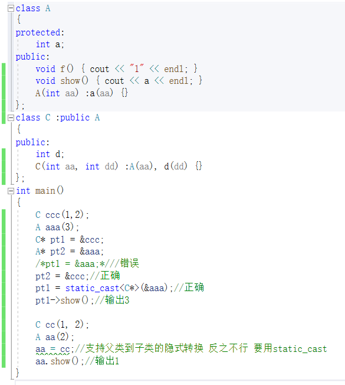

7. 虚函数相关

   类中加上了virtual关键字的函数为虚函数，不仅加上了virtual关键字，且在函数后没有实现只有 **=0**的为纯虚函数，带有纯虚函数的类为虚类，不能实例化。

   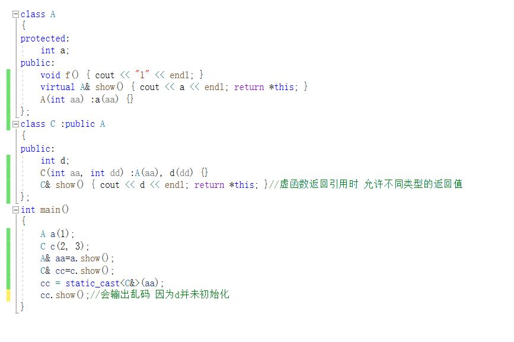

8.虚函数表地址早晚绑定，普通的重写为早绑定，即在创建对象时就绑定，而虚函数则是晚绑定，即在被调用时才绑定，所以虚函数可以帮助我们实现多态，如下是个例子

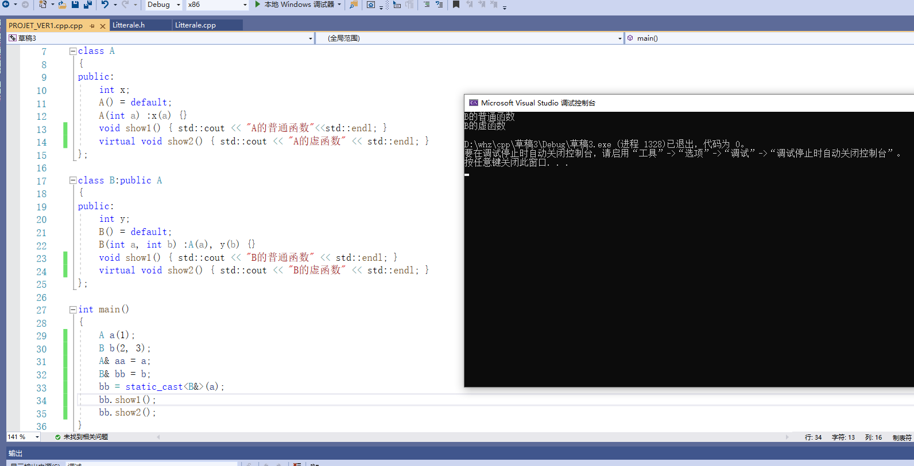

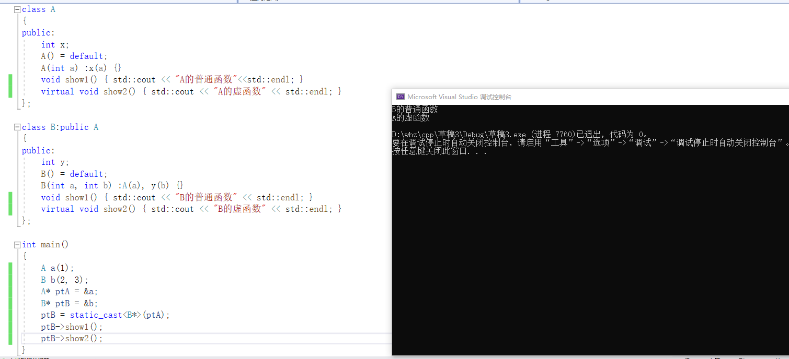

9. 模板

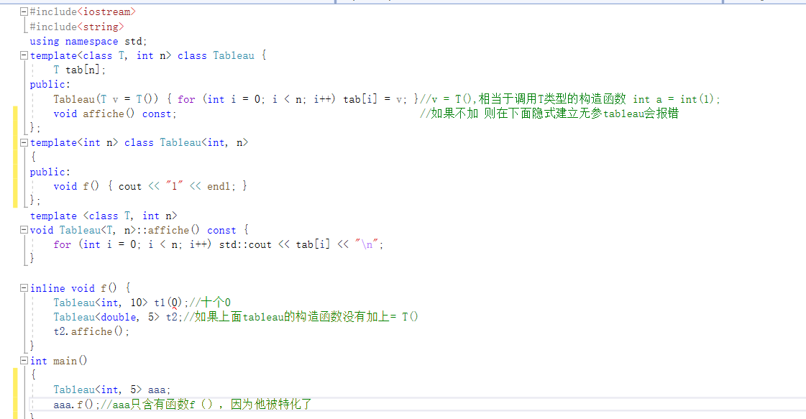

10. utility/pair

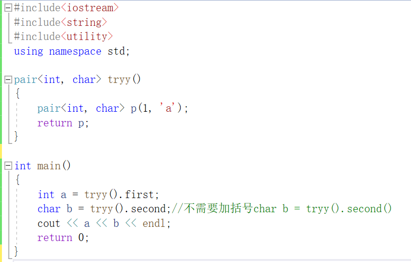