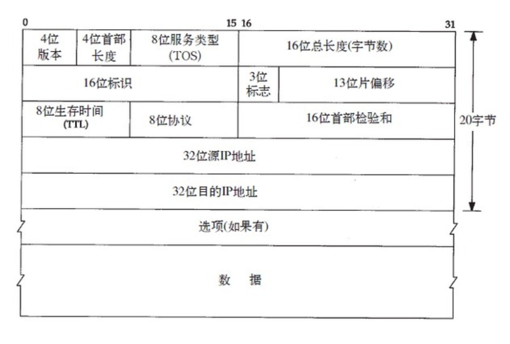

### 一些计算机网络基础

---

TCP/IP模型是互联网的基础，主要是四层模型，链路层、网络层、传输层和应用层。另外有更为详细具体的OSI七层模型，但并没有被广泛采用。

---

#### 链路层

---

数据链路层是一种协议层，它有很多协议。数据链路层**用于跨物理层在网段节点之间传输数据**，通常指以太网、无线局域网等通信手段。数据链路层提供了在网络的两个实体之间传输数据的功能。

- 以太网和802.3封装 ：

  以太网IP数据报的封装是在RFC894中定义的，IEEE802.3网络的IP数据报封装是在RFC1042中定义的。

  两种协议的头部都为mac地址，对于ip报文段，IEEE802.3封装中，采用了LLC (逻辑链路控制, 链路上层协议, 为不同的网络类型, 以太网，令牌环网等之间提供了一个通用的接口) , SNAP (子网络访问协议)的格式，以太网则是ARP/RARP（地址解析协议 : 通过IP地址获得对应的MAC地址/反向地址转换协议 : 相反)。

  LLC只出现在802.3的格式中，802.3的MAC层没有字段指明上层协议字段，但是指明了数据包长度，所以上层协议需要LLC指明。

  在ETHERNET_II帧中，把802.3的长度字段改为了type。由Type字段区分上层协议，这时候就没有必要实现LLC子层，仅包含一个MAC子层。

- ARP协议:

  在以太网中，一个主机要和另一个主机进行直接通信，必须要知道目标主机的MAC地址, ARP协议的基本功能就是通过目标设备的IP地址，查询目标设备的MAC地址，以保证通信的顺利进行。

- ARP缓存: 

  缓存最近的mac地址和ip的映射

  linux操作系统中可用 arp -a 命令来查看

- SLIP协议和PPP协议 ：

  SLIP : 串行线路网际协议, 拨号上网的基础 / PPP : 可以看作SLIP的升级, 点对点模式，由LCP( 负责设备之间**链路的创建、维护和终止**), NCP (动态ip协商等功能), PPP扩展三部分协议组成. 

- 环回接口：

  常见的127.0.0.1,作为localhost ,比较常见无需多说.

- MTU :

  数据包的最大传输单元

---

#### 网络层 (IP协议)

---

IP是TCP/IP中最为核心的协议，所有的TCP、UDP、ICMP等协议均以IP数据报的格式传输。IP协议提供不可靠、无连接的服务，它不保证数据报一定可以送达目的，也不保证数据报的先后次序。



- **版本** : IP报文版本号 IPV4:4, IPV6:6 
- **首部长度** : IP 头部信息长度，没有选项，则一般为5（5x32bit＝20B）
- **TOS** : 可以指定更细节的服务类别，如最小延迟，最大吞吐量，最高可靠性等
- **16位置总长度 **: header＋数据 总长度
- **16位标识** : IP 报文的唯一id，分片报文的id 相同，便于进行重组。
- **3位标志** : 标明是否分片。
- **片偏移** : 记录分片偏移的位置
- **TTL** : 生存时间，即路由器的跳数，每经过一个路由器，该TTL 减一
- **8位协议**  qq: 区分传输层的协议，如 TCP:6，UDP:17
- **首部校验和** : IP header校验和

---

#### 一些概念

- LAN端口：路由器上链接局域网(自己设备)的端口

- WAN端口 : 路由器上链接到外部网关，或者别的网络的端口

- NAT协议 : 内外网地址转换的协议，可以穿透内外网，实现局域网访问公网ip (要实现跨外网的局域网通讯，可以使用一台有公网ip的服务器作为转发)。原理为在网关为不同的子网ip分配不同的映射端口并且记录。

- 几类地址：

  - A类：地址范围1.0.0.1-126.255.255.255，A类IP地址的子网掩码为255.0.0.0，每个网络支持的最大主机数为256的3次方-2=16777214台。
  - B类：地址范围128.0.0.1-191.255.255.255，B类IP地址的子网掩码为255.255.0.0，每个网络支持的最大主机数为256的2次方-2=65534台
  - C类：地址范围192.0.1.1-223.255.255.255，C类IP地址的子网掩码为255.255.255.0，每个网络支持的最大主机数为256-2=254台
  - D类：以1110开始的地址，多播地址
  - E类：以11110开始的地址，保留地址

  其实这些地址只是历史遗留概念，现在很少再做区分，注意局域网地址和c类地址的概念，由于他们都是以192.***的格式，让我曾经误认为c类地址就是为局域网采用的格式，其实并不是，只不过在局域网中需要的机器数量不多，c类地址已能够支撑，其实ABC三类地址都可以作为局域网地址。

  同时192开头的地址也有公网地址，被lsp发行和维护，两者之间并没有什么绝对关联。

- ICMP : 

  ICMP报文是在IP数据报内部传输的：`| IP头部 | ICMP报文 |`

  可以反映通讯的信息，比如网络/端口是否可达，错误类型等

----

#### 路由

---

路由表 

```sh
# route -n
Kernel IP routing table
Destination     Gateway         Genmask         Flags Metric Ref    Use Iface
192.168.0.0      0.0.0.0         255.255.192.0   U     0      0        0 eth0
0.0.0.0         192.168.0.1      0.0.0.0         UG    100    0        0 eth0
```

Destination/Genmask : 目标地址和掩码 0.0.0.0为默认网关

Gateway : 下一跳，0.0.0.0说明为直连，不需要网关

Flags :

- U 该路由可用
- G 该路由发送到网关，没有则为直接链接
- H 说明目标是个独立主机，没有则为一个网络

可以使用route命令来修改路由表，同时ICMP在ip报文交换时也会更新路由表。

---

#### TCP


- 源ip地址

- 目标ip地址

- 序列号：就是握手和挥手中常说到的SYN 

  第一次握手时,会把下面的SYN位置1 然后初始化一个序列值X放在序列号中

  服务器回应 即第二次握手时候 服务器包会把 SYN和ACK都置1 然后初始化一个序列号Y 然后把应答号标为之前收到客户端的序列号X+1

  第三次 客户端发包 会把ACK置1 然后回应号记为Y+1

  以上 就是三次握手具体的帧格式

  注意 就算不是在握手过程中 这个序列号也是有值的 且在通讯过程中一次增加 为上一次发送的序号+上一次发送的包大小 比如发送端发送的一个TCP包净荷(不包含TCP头)为12byte，SN为5，则发送端接着发送的下一个数据包的时候，SN应该设置为5+12=17

- 应答号 ：就是ACK 

- 头长 代表TCP头的长度

- 四位保留号

- 8位标记：

  **CWR**(Congestion Window Reduce)：拥塞窗口减少标志set by sender，用来表明它接收到了设置ECE标志的TCP包。并且sender 在收到消息之后已经通过降低发送窗口的大小来降低发送速率。

  **ECE**(ECN Echo)：ECN响应标志被用来在TCP3次握手时表明一个TCP端是具备ECN功能的。在数据传输过程中也用来表明接收到的TCP包的IP头部的ECN被设置为11。注：IP头部的ECN被设置为11表明网络线路拥堵。

  **URG**(Urgent)：该标志位置位表示紧急(The urgent pointer) 标志有效。该标志位目前已经很少使用参考后面流量控制和窗口管理部分的介绍。

  **ACK**：取值1代表Acknowledgment Number字段有效，这是一个确认的TCP包，取值0则不是确认包。后续文章介绍中当ACK标志位有效的时候我们称呼这个包为ACK包，使用大写的ACK称呼。

  **PSH**(Push)：该标志置位时，一般是表示发送端缓存中已经没有待发送的数据，接收端不将该数据进行队列处理，而是尽可能快将数据转由应用处理。在处理 telnet 或 rlogin 等交互模式的连接时，该标志总是置位的。

  **RST**(Reset)：用于reset相应的TCP连接。通常在发生异常或者错误的时候会触发复位TCP连接。

  **SYN**：同步序列编号(Synchronize Sequence Numbers)有效。该标志仅在三次握手建立TCP连接时有效。

  **FIN**(Finish)：No more data from sender。当FIN标志有效的时候我们称呼这个包为FIN包。

- 窗口大小：16位，该值指示了从Ack Number开始还愿意接收多少byte的数据量，也即用来表示当前接收端的接收窗还有多少剩余空间，用于TCP的流量控制

- **校验位**

  首先，把伪首部、TCP报头、TCP数据分为16位的字，如果总长度为奇数个字节，则在最后增添一个位都为0的字节。把TCP报头中的校验和字段置为0（否则就陷入鸡生蛋还是蛋生鸡的问题）。
  其次，用反码相加法累加所有的16位字（进位也要累加）。
  最后，对计算结果取反，作为TCP的校验和。

- **优先指针**：16位，指向后面是优先数据的字节

---

#### TCP粘包

由于TCP协议会对上层的数据进行分割，而分割的时候有没有加入边界检验的方法，这就导致接收端可能会错误合并两个不同的tcp报文导致出错。

UDP不会有这个问题，因为UDP并没有对报文进行分割，IP协议也不会有，因为他虽然分割了，但是很清楚地记录了每个帧的偏移量，所以不会产生错误的组合

解决方法，1.加入特殊标志 只要在发送端每次发送消息的时候给消息**带上识别消息边界的信息**，接收端就可以根据这些信息识别出消息的边界，从而区分出每个消息。可以通过特殊的标志作为头尾，比如当收到了`0xfffffe`或者回车符，则认为收到了新消息的头，此时继续取数据，直到收到下一个头标志`0xfffffe`或者尾部标记，才认为是一个完整消息。

2. 加入消息长度信息 这个一般配合上面的特殊标志一起使用，在收到头标志时，里面还可以带上消息长度，以此表明在这之后多少 byte 都是属于这个消息的。如果在这之后正好有符合长度的 byte，则取走，作为一个完整消息给应用层使用。HTTP 中的`Content-Length`就起了类似的作用

---

#### TCP time_wait状态

MSL: Maximum Segment Lifetime 报文最大生存时间 指一个包文最多在网络中生存的有效时间

在客户端发送FIN 并且接受到服务端返回的ACK时 会进入一个time_wait 这时候socket连接还在 端口也没有被释放 在两个MSL后 才会结束

如果直接结束 可能会导致服务端发送回的剩余信息 被新的 占用了同一端口的套接字拿到 导致信息混乱。

TTL: time to live , ip层的概念 用来记录ip报文最大跳数

RTT：客户到服务器**往返**所花时间 round-trip time

MTU：(Maximum Transmission Unit，最大传输单元)  一个包最大的大小

MSS：Maximum Segment Size，最大报文长度 指的是除去`IP` 和 `TCP`头部之后，一个网络包所能容纳的 TCP 数据的最大长度。