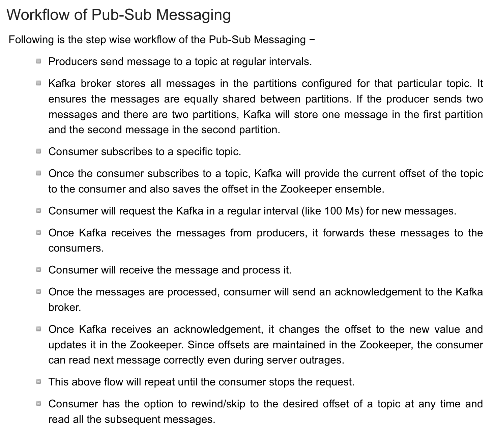

# kafka

### 1.Preface

---

Apache Kafka is a distributed publish-subscribe messaging system. It's usually been used in microservice architecture.

We could imagine there are some pipes between who sends messages ( like databases ) and who receives messages ( like users ). In those pipes we pass messages and users pick up their messages one by one.

---

**Some terminologies:**

- producer : The sender of the message

- consumer : The user and receiver of the message are the Consumer

- broker : In Kafka cluster , there may be several servers who will provide service, each server is called a broker.
- topic : Each broker has several topics, we stock different types of messages in different topics. 
- partition : The messages are been stored in files on the Kafka server. So for the same topic messages, we may store them in different files, the partition is the file where the message is stored.
- Offset : The location of message in partition ( file ).

---



---

### 2. kafka install and launch

---

##### Install:

Download:

```bash
wget https://archive.apache.org/dist/kafka/3.0.0/kafka_2.12-3.0.0.tgz
```

---

decompress:

```bash
tar -zxvf kafka_2.12-3.0.0.tgz
```

---

The directory structure：

> - Bin : Store executable files
> - config : Configuration files
> - Libs : some libraries (packages jar).
> - Site-docs : some tutorials

---

Edit configuration file : 

> The main configuration file is ``./config/server.properties``.
>
> 1. Edit broker ID .
>
> 2. Edit listeners to your ip.
>
> 3. Edit log.dirs to a persistent path
>
> 4. Edit zookeeper.connect , add zookeeper ip and host, such as :
>
>    ``Zookeeper.connect=2001:67c:1254:fd:e854::1:2181,2001:67c:1254:e:8c:498:0:1:2181/kafka``

---

launch:

> ``bin/kafka-server-start.sh -daemon config/server.properties``

----

### 3. Topics command

---

> ```
> /bin/kafka-topics.sh
> ```
>
> Parameter:
>
> - --bootstrap-server : to refer the server connect to ( e.g. `/bin/kafka-topics.sh --bootstrap-server 172:0:0:1:9092`)
> - --topic {topic_name} : to refer which topic you want to operate
> - --create/--delete ：as their name  ( e.g. `/bin/kafka-topics.sh --bootstrap-server 172:0:0:1:9092 --topic test --create` )
> - --alter : edit content of topic (pay attention:you can only increase the number of partition)
> - --list : show all the topiv
> - --partition {number_of_partition}  ( e.g. `/bin/kafka-topics.sh --bootstrap-server 172:0:0:1:9092 --topic test --create --partition 1` )
> - --describe : show the detail information of one topic.

---

### 4.Producer command

---

> ```
> /bin/kafka-console-producer.sh
> ```
>
> Parameter :
>
> - --bootstrap-server : refer the server
> - --topic : to refer to send which topic
>   - Example: ``/bin/kafka-console-producer.sh --bootstrap-server 2001:67c:1254:fd:e854::1:9092 --topic test`` 

###  5.Consumer command 

---

> ```
> /bin/kafka-console-consumer.sh
> ```
>
> Parameter :
>
> - --bootstrap-server : to refer the server
>
> - --topic : to refer to get message from which topic
>
>   - Example: ``/bin/kafka-console-producer.sh --bootstrap-server 2001:67c:1254:fd:e854::1:9092 --topic test`` 
>
>     In this way, client can only read the message after connection
>
>   - if you want to get historical message, add option ``--from-beginning``

---

### 6.Produce Process

---

> In main thread, Producer will firstly sent messages to a Interceptor, and then message will be serialized by the serialisers, finally be sent to a Partitioner.
>
> In partitioner,message will be decided to be sent to which RecordAccumulator, the function of recordAccumulator is to accumulate some message and send them together to improve efficiency. There are two main parameters: **batch.size** which means when the size of the message in a recordAccumulator arrive this value, it will be sent, **linger.ms** which means in what a interval that there is no new message, the recordAccumulatorw will send all message at once.


