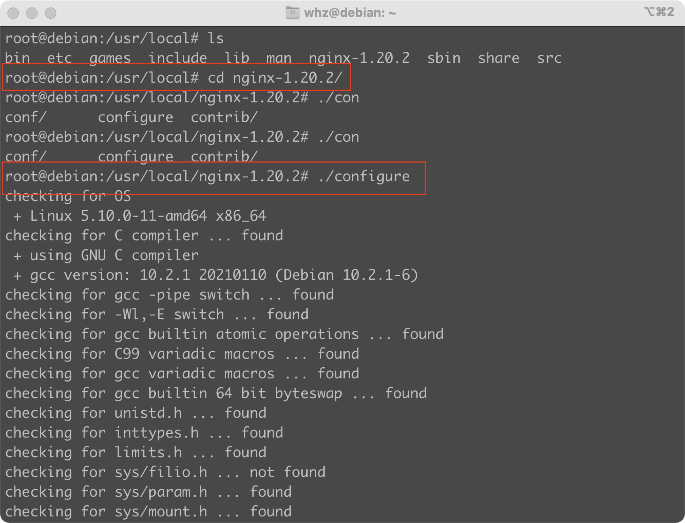

# nginx download

> To learn how to use, wo start with configuration file.
>
> And for the beginning, we download and decompress it.
>
> 
>
> 
>
> 
>
> Now, we can find a nginx folder in `/usr/local`,with the bin file `/usr/local/nginx/sbin/nginx` and configuration file in `/usr/local/nginx/conf/nginx.conf`.
>
> Nginx handles requests in an asynchronous, non-blocking manner，that‘s why it's always efficient.

# nginx command

> Here is some frequently-used command of Nginx.
>
> `/usr/local/nginx/sbin/nginx` : Start the nginx service.
>
> `/usr/local/nginx/sbin/nginx -s stop` : Stop the nginx service.
>
> `/usr/local/nginx/sbin/nginx -s reload` : Reload the nginx service.
>
> `/usr/local/nginx/sbin/nginx -t` Check if there is any problem of configuration file.

# some problems

> A. When I try to start the Nginx service in my cloud server, it failed. After checking, I find that the default port of Nginx is 80, and I have already a service apache that uses port 80 in my server, so I need to shut down the apache service or change another port for Nginx.

>B. If you want to use the IP of the server as a URL, you need to add IP in `listen`, or you will fail to access your server.

> C. When you try to find the process about Nginx `ps aux|grep Nginx`, you will find two processes, one is `worker` and another is `master`, every time you use `/usr/local/nginx/sbin/nginx -s stop` to stop service nginx, you will find `master` process has not been killed, and the port will also keep being used. You need to kill it by yourself or use `/usr/local/nginx/sbin/nginx -s quit`, to completely finish Nginx service.nginx configuration

# Linux network base

> ### firewall_cmd
>
> `firewall-cmd --help`  See all usage
>
> `firewall-cmd --state` See state of firewall
>
> `firewall-cmd --reload` Reload firewall
>
> `systemctl start/stop firewalld` Start/stop service firewall
>
> `firewall-cmd --add-port=443/tcp` Open a port
>
> `firewall-cmd --permanent --add-port=3690/tcp ` open a port permanently
>
> ### netstat
>
> `netstat -nutlp` u - udp link, t -  tcp link, l - listen, p - show the name of application


# nginx configuration

> Then, the most important part, the nginx configuration file, who define how nginx works.
>
> The basic structure of nginx configuration file is:
>
> ```nginx
> #section global
> 
> events{
>   #section event
> }
> 
> http{
>   #section http
>   
>   server{
>     #section server
>     
>     location = / {
>       #section location
>     }
>   }
>   
>   server{
>     #section server
>     
>     location = / {
>       #section location
>     }
>     
>   }
>   
> }
> ```
>
> ## section global
>
> The global block mainly sets some configuration directives that affect the overall operation of the Nginx server. Therefore, the scope of these directives is the global of the Nginx server.
>
> `user nobody nobody;` to set user and group of nginx
>
> `worker_processes 1;` to set maximal number of processes 
>
> `pid XX;` to declare path of pid file
>
> `error_log;` to set the path and log level of the error log
>
> ## section events
>
> Mainly affects the network connection between the Nginx server and the user.
>
> `use method;` to specify which network IO model to use for example `use epoll/use select`
>
> ## section server 
>
> `listen` :distinguish the port you listen, and if you want to access by ip, also put it here
>
> `server_name `: distinguish the host name of request
>
> It's means that if you want to do some different responses to different requests, you can do it with these two options.
>
> `location`: to define your rules to access your server resources, like the example:
>
> ```nginx
> location / {
>     root   html;
>     index  index.html index.htm;
> }
> ```
>
> That means when you access the server by http request like this : `http://your_host_name/`,it will be redirect to `http://your_host_name/html` and set file `index.html` or `index.htm` as index.
>
> There are more other rules you can search in `nginx.org`


